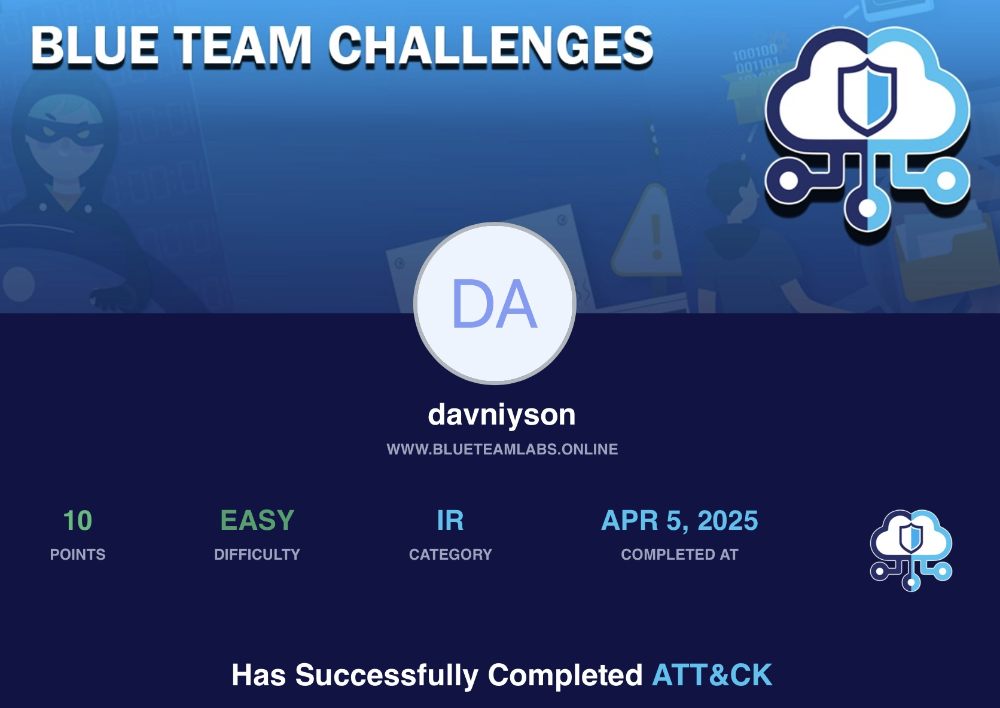

# 🛡️ BTLO - ATT&CK Challenge

- **Difficulty:** Easy  
- **Category:** Incident Response  
- **Platform:** [Blue Team Labs Online (BTLO)](https://blueteamlabs.online/)  
- **Focus:** Operationalizing the [MITRE ATT&CK Framework](https://attack.mitre.org)

---

## 📌 Scenario

You are hired as a Blue Team member for a company.  
You are assigned to perform threat intelligence for the company.  
See how you can operationalize the MITRE ATT&CK framework to solve these scenario-based problems.

---

## 🔍 Step-by-Step

### 1️⃣ Question:

> Your company heavily relies on cloud services like Azure AD and Office 365.  
> What technique should you focus on mitigating, to prevent an attacker performing Discovery activities if they have obtained valid credentials?  
> _(Hint: Not using an API to interact with the cloud environment!)_

**🛠 How I solved it:**

- Navigated to the MITRE ATT&CK website 
- Searched for techniques Discovery group involving **valid credentials**
- Focused on techniques that use **PowerShell** or **cmdlets** instead of APIs

### 2️⃣ Question:

> You were analyzing a log and found uncommon data flow on port 4050. What APT group might this be?

**🛠 How I solved it:**

- I searched Google for information about activity on TCP port 4050
- Identified a known association between this port and a specific tool or malware
- Cross-checked the results against the MITRE ATT&CK database
- Found the APT group documented by MITRE as using this port

### 3️⃣ Question:

> The framework has a list of 9 techniques that falls under the tactic to try to get into your network. What is the tactic ID?

**🛠 How I solved it:**

- Opened the MITRE ATT&CK site → went to the Tactics section. 
- Looked for the one responsible for getting into the network.
- Found Initial Access — it had exactly 9 techniques. Took the ID from there.

### 4️⃣ Question:

> A software prohibits users from accessing their account by deleting, locking the user account, changing password etc.
> What such software has been documented by the framework?

**🛠 How I solved it:**

- At first I tried searching in the Software section, but didn’t find anything that matched the description.
- Then I checked the Impact tactic — since it’s about locking users out. 
- There I found the right software, even though its main description in the Software section focuses on something else.

### 5️⃣ Question:

> Using ‘Pass the Hash’ technique to enter and control remote systems on a network is common.
> How would you detect it in your company? 

**🛠 How I solved it:**

- I searched for Pass the Hash in the MITRE ATT&CK framework and found it.
- Then I went to the Detection section of that technique and found the answer.
  
---

## 🧠 Notes

- MITRE ATT&CK is super useful when you break down the scenario by **tactic first**, then narrow it down by technique.
- Not every software in ATT&CK has a clear description — sometimes better to search by **behavior or tactic**, not just names.
- Always check the **Detection** section — it often has real-world event IDs, log types, or tools to monitor.
- Good tools/resources used:
  - 🔍 [MITRE ATT&CK Navigator](https://mitre-attack.github.io/attack-navigator/)
  - 🧭 Google with `site:attack.mitre.org` filter
  - 🧰 OSINT & log analysis skills help in threat intelligence

---

## 📂 Files

This challenge has no files attached. Only ATT&CK framework usage and reasoning.

---

## 🖼 Certificate

## 🧑‍💻 Author

**Anton Ivanov**  
Cybersecurity Learner | SOC Analyst in progress  
📍 Paradise, NL, Canada  
📫 [keepdsn@icloud.com](mailto:keepdsn@icloud.com)  
🔗 [linkedin.com/in/davniyson](https://linkedin.com/in/davniyson)
