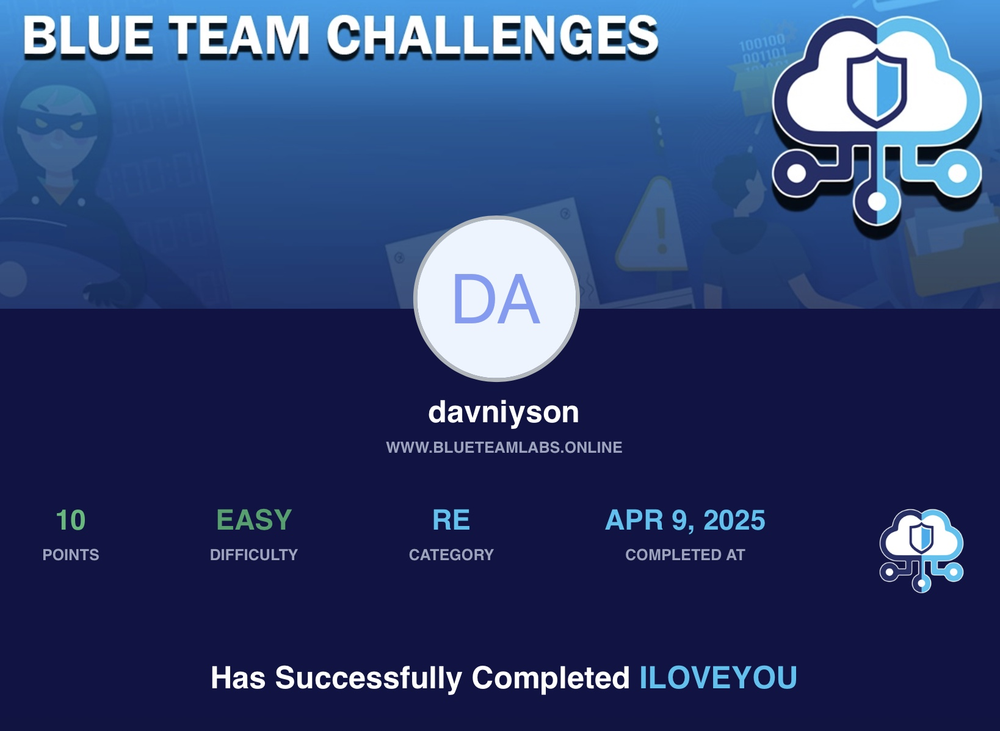

# 🛡️ BTLO - ILOVEYOU
- **Difficulty:** Easy  
- **Category:** Reverse Engineering
- **Platform:** [Blue Team Labs Online (BTLO)](https://blueteamlabs.online/)  
- **Focus:** TextEditor, Regshot

---

## 📌 Scenario

ILOVEYOU the 3 magical words which have an impact in most of the people's life. \
On the other hand, these 3 words don't need any introduction for the people in the Infosec industry. \
Let's relive history by analysing the ‘ILOVEYOU’ malware. 
- ! This challenge should be completed in a virtual machine as it contains real malware. 

---

## 🔍 Step-by-Step

### 1️⃣ What is the text present as part of email when the victim received this malware? 

> First, I reviewed the file manually using `cat` to locate the section that builds the email object. \
> The message was not directly searchable via keywords like `mail, e-mail`, however, by focusing on properties like `Subject` and `Body`,
> I identified the exact message embedded in the email created by the worm.

### 2️⃣ What is the domain name that was added as the browser's homepage?

> I started by searching the script using `grep` to find references to URLs and registry changes.
> This led me to a section in the `regruns()` function, where the malware randomly sets a malicious domain as the Internet Explorer start
> page to initiate the download of a trojan executable.

### 3️⃣ The malware replicated itself into 3 locations, what are they? 

> Located all lines using `grep` `'copy'`, and analyzed their context.
> The paths included system and Windows folders stored in variables, which I resolved manually by replacing `dirsystem` and `dirwin` with
> their actual default values. This allowed me to determine the exact target paths for replication.

### 4️⃣ What is the name of the file that looks for the filesystem?

> Although the main script (LOVE-LETTER-FOR-YOU.TXT.vbs) initiates execution and replication, the file responsible for interacting with the > filesystem in depth is `********.***`. This file is explicitly checked in the script, before more advanced actions like start page
> modification are triggered.

### 5️⃣ Which file extensions, beginning with m, does this virus target?

> I analyzed the section where the malware iterates through files in each folder.
> There I identified multiple targeted extensions — including image and audio files — and focused specifically on those starting with “m”
> for this question.

### 6️⃣ What is the name of the file generated when the malware identifies any Internet Relay Chat service?

> While reviewing the file infection function, I located a conditional block that detects common IRC-related filenames.
> When detected, the malware creates a file containing a malicious mIRC script designed to propagate the worm.

### 7️⃣ What is the name of the password stealing trojan that is downloaded by the malware? 

> This information was not directly found in the script. \
> I performed a Google search and found historical reports, confirming that the worm downloaded a trojan named `*****` that was
> responsible for password theft.

### 8️⃣ What is the name of the email service that is targeted by the malware? 

> Identified in the section of the script where it initializes a mail object using `****.Application.`

### 9️⃣ What is the registry entry responsible for reading the contacts of the logged in email account? 

>  I located the `spreadtoemail()` function and examined where the script interacts with the registry.
> It reads values under the `HKEY_CURRENT_USER\***` key to track address lists and individual recipients.

### 🔟 What is the value that is stored in the registry to remember that an email was already sent to a user?

> Found in the same function.
> After sending an email to a contact, the script stores a `***` value under the corresponding registry key to prevent resending
> to the same address.

---

## 🛠 Tools & Techniques Used

- cat, grep — for static inspection
- Manual code review — for identifying logic and hidden values
- Google Search — for historical context on malware payloads
- Threat intelligence reports — to confirm third-party components.

---

## 🧠 Notes

- The ILOVEYOU worm used aggressive and widespread replication methods through email and file infection.
- Variable-based paths like `dirsystem` and `dirwin` needed to be resolved manually.
- Many strings were written in ways that evade simple text search, requiring full script reading.
- This challenge strengthened my skills in:
> - Analyzing legacy VBScript malware
> - Mapping malware behavior to registry abuse
> - Researching real-world malware beyond code context

---

## 📂 Files

- This challenge included a infected file.
- No additional attachments.

---

## 🖼 Certificate

## 🧑‍💻 Author

**Anton Ivanov**  
Cybersecurity Learner | SOC Analyst in progress  
📍 Paradise, NL, Canada  
📫 [keepdsn@icloud.com](mailto:keepdsn@icloud.com)  
🔗 [linkedin.com/in/davniyson](https://linkedin.com/in/davniyson)
