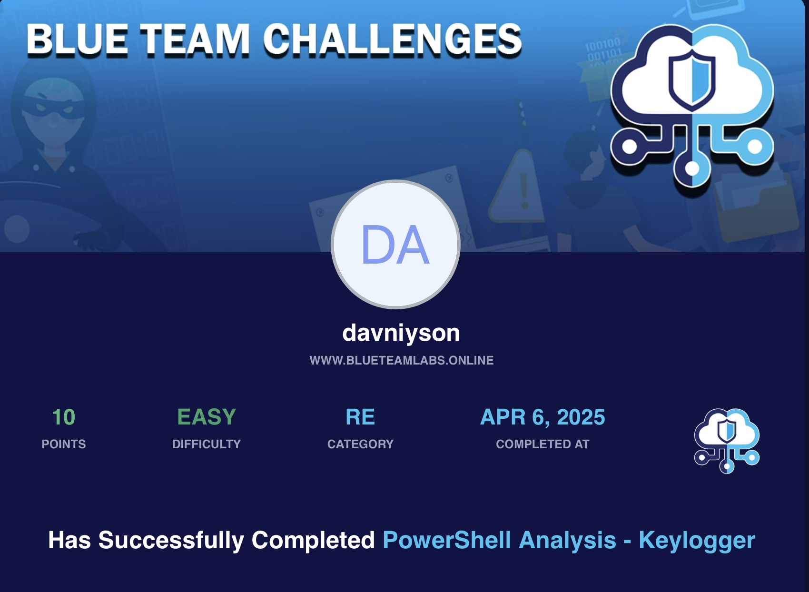

# 🛡️ BTLO - PowerShell Analysis - Keyloger Challenge

- **Difficulty:** Easy  
- **Category:** Reverse Engineering
- **Platform:** [Blue Team Labs Online (BTLO)](https://blueteamlabs.online/)  
- **Focus:** Text Editor

---

## 📌 Scenario

A suspicious PowerShell script was found on one of our endpoints. Can you work out what it does?
---

## 🔍 Step-by-Step

### Questions:

> - What is the SHA256 hash value for the PowerShell script file?
> - What email address is used to send and receive emails? 
> - What is the password for this email account? 
> - What port is used for SMTP? 
> - What DLL is imported to help record keystrokes? 
> - What directory is the generated txt file put in?

**🛠 How I solved it:**

- A very simple challenge.
- After extracting the archive in an isolated virtual machine, all answers were found using just the cat and grep commands.

🔐 The script was clearly designed to log keystrokes and exfiltrate data via email.
No obfuscation or encoding was used, making analysis very straightforward.
  
---

## 🧠 Notes

PowerShell can be extremely dangerous when used for malicious purposes — this challenge is a great reminder.
The keylogger used a plain .txt file for storage and basic SMTP for exfiltration.
This challenge reinforced my understanding of:
 - Basic PowerShell script structure
 - Identifying hardcoded credentials and IOCs
 -  Using simple tools (cat, grep) to perform quick static analysis
 - Practicing safe analysis in an isolated environment (VM) is crucial.
 - Always check for email-based data exfiltration when dealing with suspicious scripts.

---

## 📂 Files

This challenge has no files attached. Only ATT&CK framework usage and reasoning.

---

## 🖼 Certificate

## 🧑‍💻 Author

**Anton Ivanov**  
Cybersecurity Learner | SOC Analyst in progress  
📍 Paradise, NL, Canada  
📫 [keepdsn@icloud.com](mailto:keepdsn@icloud.com)  
🔗 [linkedin.com/in/davniyson](https://linkedin.com/in/davniyson)
