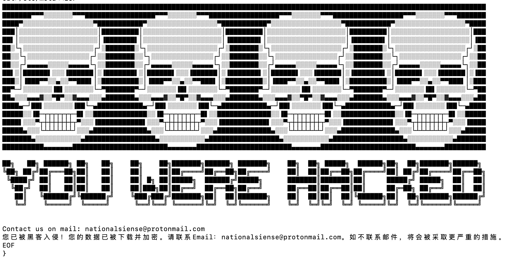
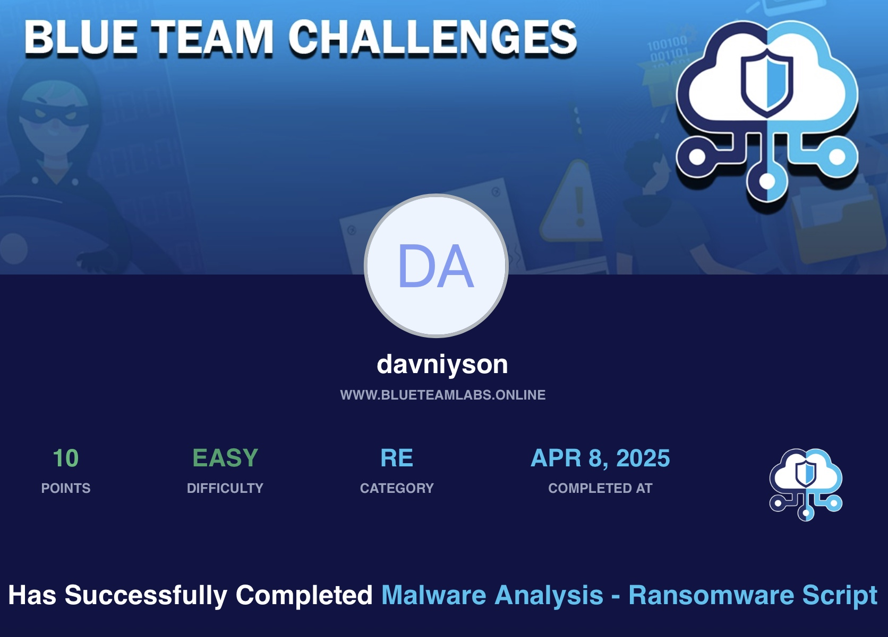

# 🛡️ BTLO - Malware Analysis - Ransomware Script

- **Difficulty:** Easy  
- **Category:** Reverse Engineering
- **Platform:** [Blue Team Labs Online (BTLO)](https://blueteamlabs.online/)  
- **Focus:** TextEditor
---

## 📌 Scenario

One of our web servers recently got compromised and was hit with ransomware. Luckily we had a restore point just before the files were encrypted, and managed to recover a suspicious script file that didn't appear to have been run yet.

---

## 🔍 Step-by-Step

### 1️⃣ What is the malicious IP address referenced multiple times in the script?:

> Found using the `strings` command and filtered with `grep -i http`.
> - Method: Looked for hardcoded URLs and IPs in string content.

### 2️⃣ The script uses apt-get to retrieve two tools, and uses yum to install them. What is the command line to remove the yum logs afterwards?

> Found using the `strings` command with `grep -i yum`.
> -Method: Located cleanup command following yum installation sections.

### 3️⃣ A message is created in the file /etc/motd. What are the three first words?

> Identified using: `cat mal.txt | grep /etc/motd -A 25`
> - Method: Heredoc block writes the full ASCII and ransom message to /etc/motd. The first three words after `<<EOF` are extracted.

### 4️⃣ This message also contains a contact email address to have the system fixed. What is it? 

> Found in the same `/etc/motd` block.
> - Method: Email is visible near the end of the ransom message.

### 5️⃣ When files are encrypted, an unusual file extension is used. What is it?

> Detected in multiple lines, verified using `hexdump` to examine the raw bytes and `CyberChef` to confirm the symbol rendering.
> - Method: The `.*` (Unicode radioactive sign U+2622) is used as the file extension.

### 6️⃣ There are 5 functions associated with the encryption process that start with ‘encrypt’. What are they, in the order they’re actually executed in the script?

> Identified using: `grep`
> - needs double check the order

### 7️⃣ The script will check a text file hosted on the C2 server. What is the full URL of this file?

> Quickly found using `grep`
> - Method: Revealed hardcoded C2 URL pointing to .txt file used to trigger encryption logic.

---

## 🛠 Tools & Techniques Used

- cat, grep, strings — for exploring script contents
- hexdump, CyberChef — to analyze structure and detect Unicode
- Manual function trace and bash flow analysis
- Sandbox virtual machine for safe examination

---

## 🧠 Notes

- The script adds a new user, disables others, and encrypts critical file types.
- It uses obfuscated Unicode extensions to hide encrypted files.
- The use of multiple package managers (APT/YUM) increases compatibility across systems.
- Communication with a Telegram bot and C2 infrastructure is implemented.
- The motd file is overwritten with a full-screen ASCII ransom message, including email contact.
- This challenge strengthened my skills in:
> - Bash malware static analysis
> - Detecting obfuscation techniques
> - Understanding script logic and flow

---

## 📂 Files

- This challenge involved analyzing a malicious *.txt file.
Note: The original script file is not attached for safety reasons.

---

## 🖼 Certificate

## 🧑‍💻 Author

**Anton Ivanov**  
Cybersecurity Learner | SOC Analyst in progress  
📍 Paradise, NL, Canada  
📫 [keepdsn@icloud.com](mailto:keepdsn@icloud.com)  
🔗 [linkedin.com/in/davniyson](https://linkedin.com/in/davniyson)

