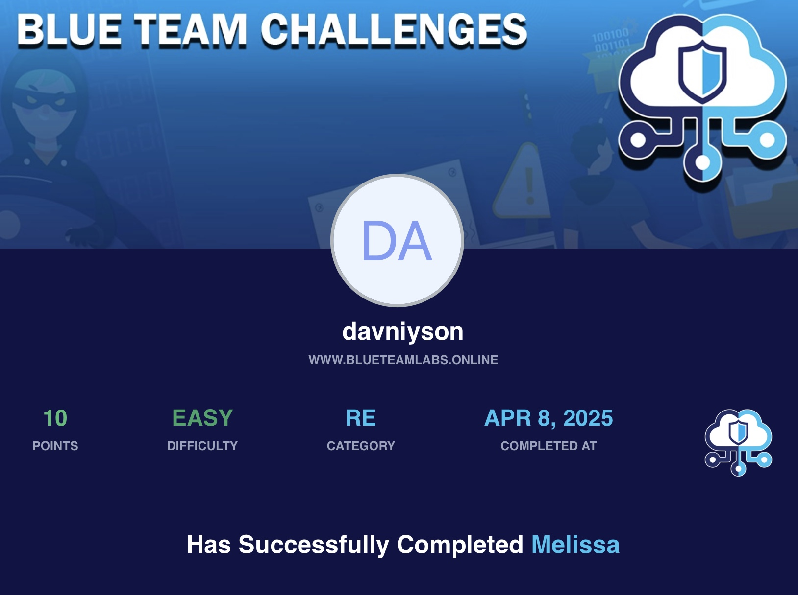

# 🛡️ BTLO - Melissa

- **Difficulty:** Easy  
- **Category:** Reverse Engineering
- **Platform:** [Blue Team Labs Online (BTLO)](https://blueteamlabs.online/)  
- **Focus:** TextEditor, Oledump
---

## 📌 Scenario

Melissa aka W97M.Melissa.A (Symantec) or Virus:W32/Melissa (F-Secure) is a macro virus dates back to March 26, 1999.
This challenge should be completed in a virtual machine as it contains real malware.

---

---

## 🔍 Step-by-Step

### 1️⃣ Submit the stream number that contains the Melissa macro in the `LIST.DOC` file>

> Used `oleid` to inspect the structure of the OLE file. 
> One of the streams was marked as containing VBA macros, and it was clearly indicated as the suspicious stream based on the tool’s output.

### 2️⃣ After identifying which version of word, Melissa will enable all macros from registry?

> Opened the file with `olevba` and manually inspected the extracted macro code. 
> Found logic that checks the Word version.

### 3️⃣ What is the email service targeted by Melissa?

> Found by analyzing the `any.run` report.

### 4️⃣ How many number of email addresses were collected?

> Reviewed the macro script manually via`olevba`.

### 5️⃣ What is the string used by melissa to identify whether a PC is infected or not and decide whether to collect email addresses or not?

> Carefully examined the conditional logic in the macro code. 
> Found a string that the virus checks for on the system to determine whether it’s already infected. 

### 6️⃣ What is the variable responsible for identifying the email username of the infected PC?

> Searched the macro dump for references to "username" using `grep`.

### 7️⃣ What is the text in email body used for spreading melissa ?

> Used `grep` 'body' on the macro output. Found the line responsible for setting the message body in the email that Melissa sends. 

### 8️⃣ What is the text that is inserted by Melissa in an open word document?

> Used `grep` 'insert' on the macro output.

---

## 🛠 Tools & Techniques Used

- `oleid` — for OLE stream and macro detection
- `olevba` — for macro extraction and static code analysis
- `any.run` — to observe malware behavior in a dynamic environment
- `grep`, `cat` — for keyword-based macro navigation
- Manual inspection — to interpret VBA code logic

---

## 🧠 Notes

- Melissa is a classic example of how simple macro logic can enable mass propagation via email clients.
- Reinfection prevention logic was implemented through file presence checks.
- Address harvesting and propagation logic are embedded directly in the macro using Outlook's object model.
- This challenge improved my skills in:
> - Extracting and interpreting malicious macros
> - Recognizing malware persistence techniques
> - Analyzing VBA structures for email-based worms

---

## 📂 Files

- This challenge included a `.doc` (infected).
- No additional attachments.

---

## 🖼 Certificate

## 🧑‍💻 Author

**Anton Ivanov**  
Cybersecurity Learner | SOC Analyst in progress  
📍 Paradise, NL, Canada  
📫 [keepdsn@icloud.com](mailto:keepdsn@icloud.com)  
🔗 [linkedin.com/in/davniyson](https://linkedin.com/in/davniyson)
