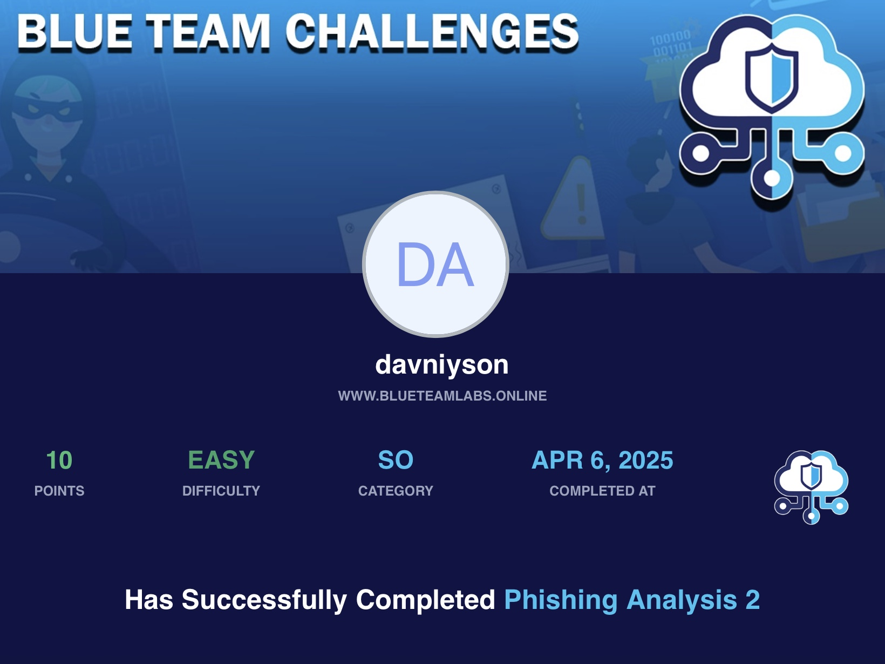

# 🛡️ BTLO - Phishing Analysis 2

- **Difficulty:** Easy  
- **Category:** Security Operations
- **Platform:** [Blue Team Labs Online (BTLO)](https://blueteamlabs.online/)  
- **Focus:** TextEditor, Thunderbird
---

## 📌 Scenario

Put your phishing analysis skils to the test by triaging and collecting information about a recent phishing campaign.
A suspicious .eml email file was submitted for analysis. Your task is to examine it and extract critical information related to a potential phishing attempt.

---

## 🔍 Step-by-Step

### 1️⃣ What is the sending email address?:

> Found using the EML Analyzer and verified with the `cat` command.
> - Method: Located in the `From:` header.

### 2️⃣ What is the recipient email address?

> Found using the EML Analyzer and confirmed via `cat`.
> - Method: Located in the `To:` header.

### 3️⃣ What is the subject line of the email?

> Identified using the EML Analyzer and `cat`.
> - Method: Found in the `Subject:` header.

### 4️⃣ What company is the attacker trying to imitate?

> Determined from branding in the message content using the EML Analyzer and verified with `cat`.
> - Method: The spoofed company is visible in the email body.

### 5️⃣ What is the date and time the email was sent?

> Extracted using the following terminal command: `cat email.eml | grep -i date`
> - Note: The date format shown in the EML Analyzer did not match the required format, so it was retrieved directly from the raw `.eml` file.

### 6️⃣ What is the URL of the main call-to-action button?

> Opened the `.eml` file in a detached virtual machine and manually extracted the link.
> - Reason: The link was embedded in an encoded HTML section and not visible via `cat`.

### 7️⃣ What is the first sentence (heading) displayed on the target website (via URL2PNG)?

> URL2PNG was not functional.
> The link was opened in an isolated virtual machine, and the heading was copied manually from the rendered webpage.

### 8️⃣ What encoding scheme is used in the email body?

> A very common encoding scheme was used.
> - Method: Located in the email headers as: `Content-Transfer-Encoding:` 

### 9️⃣ What is the URL used to retrieve the company’s logo in the email?

> Found using the EML Analyzer.
> - Reason: The image source was located in the HTML body, which was ***-encoded, and not visible using `cat`.

### 9️⃣ What is the Facebook username mentioned in one of the URLs?

> Found using the EML Analyzer.
> - The URL containing the Facebook profile was found inside an encoded HTML section, inaccessible via `cat`.

---

## 🛠 Tools & Techniques Used

- cat, grep — for inspecting plaintext headers
- EML Analyzer — for decoding and viewing HTML body
- Isolated Virtual Machine — for safely opening potentially malicious links
- Manual inspection of raw EML file with a text editor

---

## 🧠 Notes

- Many phishing emails use `***` to encode HTML content and obfuscate malicious links or embedded resources.
- Always analyze emails in a sandbox or isolated VM to avoid accidental execution of malicious content.
- Email headers often reveal key metadata without needing to decode the body.
- This challenge improved my skills in:
 > Email header analysis
 > Recognizing encoding schemes
 > Using safe environments for dynamic inspection
---

## 📂 Files

- This challenge included a `.eml` file containing a encoded HTML phishing email.
- No additional attachments.

---

## 🖼 Certificate

## 🧑‍💻 Author

**Anton Ivanov**  
Cybersecurity Learner | SOC Analyst in progress  
📍 Paradise, NL, Canada  
📫 [keepdsn@icloud.com](mailto:keepdsn@icloud.com)  
🔗 [linkedin.com/in/davniyson](https://linkedin.com/in/davniyson)
