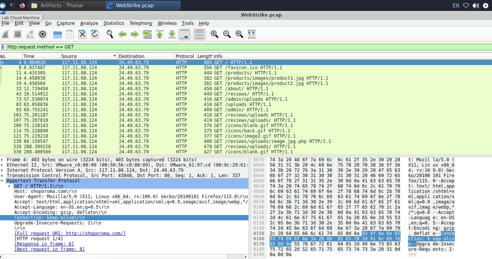
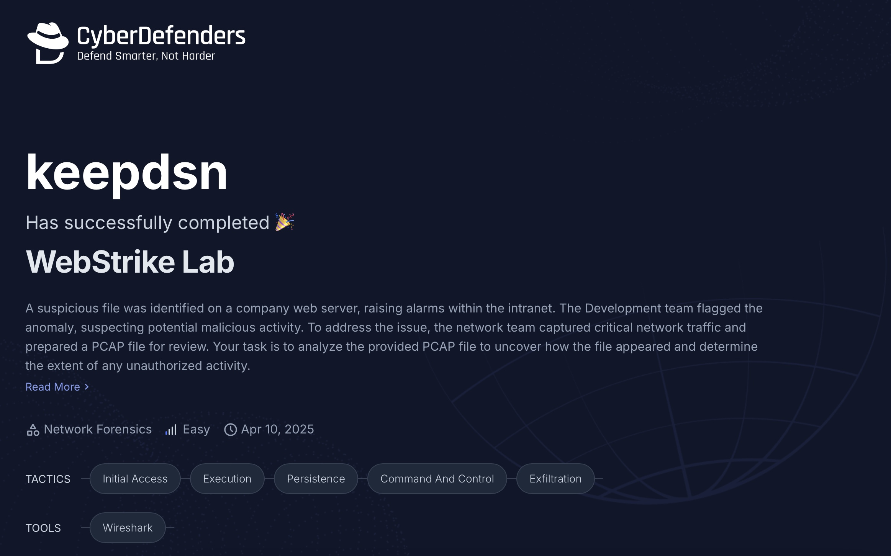

# 🛡️ CyberDefenders - WebStrike

- **Difficulty:** Easy  
- **Category:** Network Forensics
- **Platform:** [CyberDefenders](https://cyberdefenders.org/dashboard/)
- **Tactics:**  `Initial Access`, `Execution`, `Persistence`, `Command and Control`, `Exfiltration`
---

## 📌 Scenario

A suspicious file was identified on a company web server, raising alarms within the intranet. The Development team flagged the anomaly, suspecting potential malicious activity. To address the issue, the network team captured critical network traffic and prepared a PCAP file for review. \
Your task is to analyze the provided PCAP file to uncover how the file appeared and determine the extent of any unauthorized activity.

---

## 🔍 Step-by-Step

### 1️⃣ From which city did the attack originate?

> Identified by filtering `GET` requests in Wireshark, extracting the source IP, and confirming geolocation using `ipinfo.io`.

### 2️⃣ What's the attacker's User-Agent?

> Found by inspecting `http.request` packets in Wireshark and checking the `User-Agent` field in HTTP headers of the initial malicious request.

### 3️⃣ What is the name of the malicious web shell that was successfully uploaded?

> Discovered by filtering `POST` requests in Wireshark, then following the TCP stream to observe the uploaded filename in the payload.

### 4️⃣ Which directory is used by the website to store the uploaded files?

> Determined by inspecting the `Request URI` of the malicious POST request. The directory name precedes the uploaded shell file path.

### 5️⃣ Which port, opened on the attacker's machine, was targeted by the malicious web shell for establishing unauthorized outbound communication?

> Identified in the same TCP stream as the uploaded shell by observing outbound TCP connection initiated from the server to the attacker's IP.

### 6️⃣ Which file was the attacker attempting to exfiltrate?

> Confirmed by analyzing executed commands via cmd= in HTTP requests. The accessed file path was visible in the shell's response stream.

---

## 🛠 Tools & Techniques Used

- Wireshark
- HTTP filter by method (GET, POST)
- TCP stream analysis
- ipinfo.io (IP Geolocation)
- Header inspection
- Reverse shell behavior detection

---

## 🧠 Notes

- Web shell was uploaded via POST and accessed shortly after via GET
- Attacker initiated outbound connection for reverse shell access
- Attempted to read sensitive files through command execution over HTTP

---

## 📂 Files

- This challenge included a `.pcap` file.
- No additional attachments.

---

## 🖼 Certificate

## 🧑‍💻 Author

**Anton Ivanov**  
Cybersecurity Learner | SOC Analyst in progress  
📍 Paradise, NL, Canada  
📫 [keepdsn@icloud.com](mailto:keepdsn@icloud.com)  
🔗 [linkedin.com/in/davniyson](https://linkedin.com/in/davniyson)
