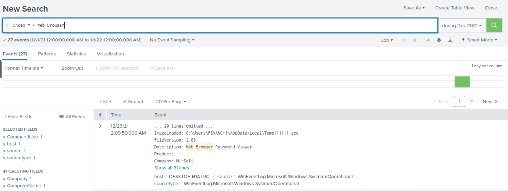
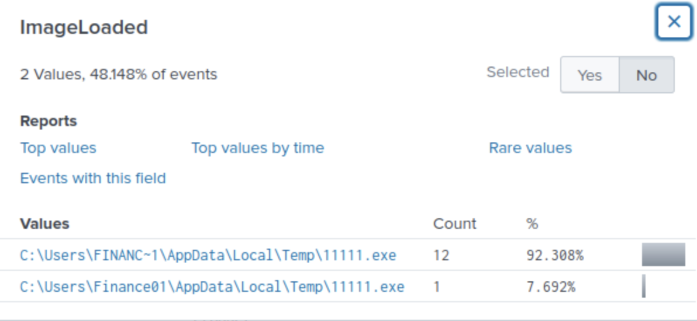
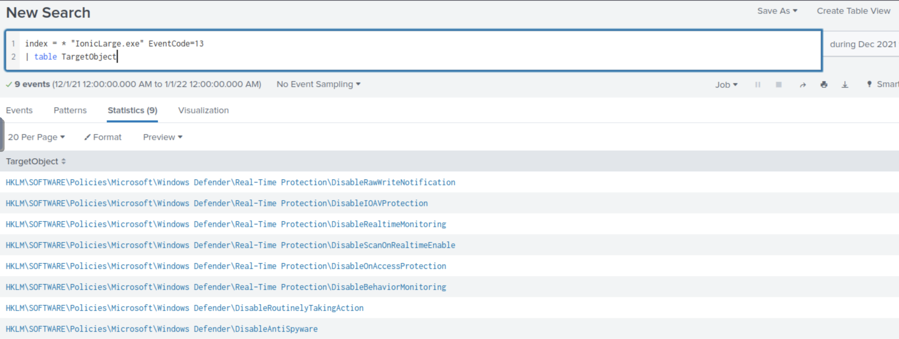
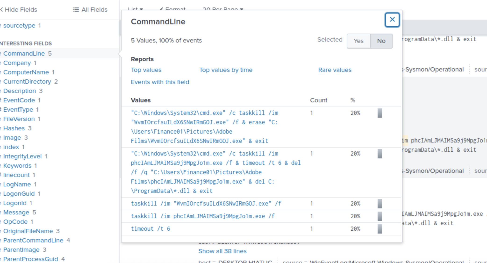
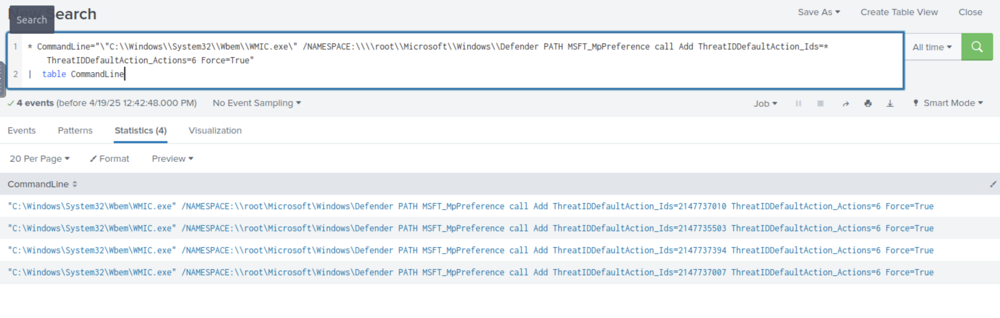
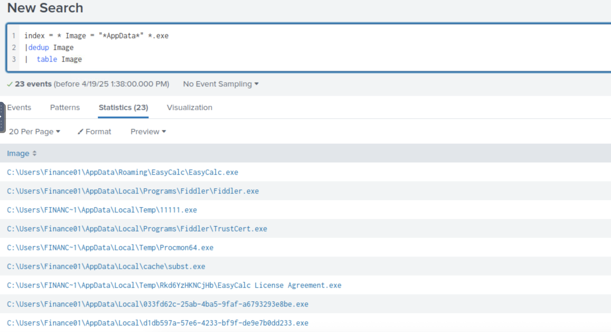
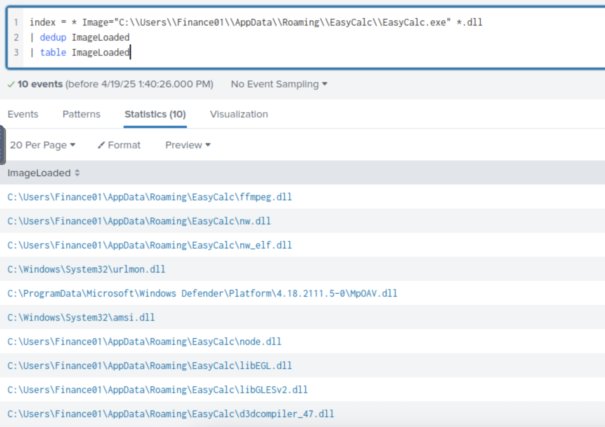

# 🛡️ TryHackMe - New Hire Old Artifacts

- **Difficulty:** Medium 
- **Category:** Threat Hunting
- **Platform:** [Tryhackme](https://tryhackme.com/dashboard)
- **Tactics:**  - `Endpoint Investigation`, `Process & Registry Analysis`, `PowerShell Behavior`
  
---

## 📌 Scenario

You are a SOC Analyst for an MSSP (managed Security Service Provider) company called TryNotHackMe.

A newly acquired customer (Widget LLC) was recently onboarded with the managed Splunk service. The sensor is live, and all the endpoint events are now visible on TryNotHackMe's end. Widget LLC has some concerns with the endpoints in the Finance Dept, especially an endpoint for a recently hired Financial Analyst. The concern is that there was a period (December 2021) when the endpoint security product was turned off, but an official investigation was never conducted. 

Your manager has tasked you to sift through the events of Widget LLC's Splunk instance to see if there is anything that the customer needs to be alerted on. 

Happy Hunting!

---

## 🔍 Step-by-Step

### 1️⃣ A Web Browser Password Viewer executed on the infected machine. What is the name of the binary? Enter the full path.

> Launch `Splunk` and check the dataset timeframe to determine whether filtering by December is necessary. It’s not — the dataset is already limited to December 2021.

> Start with a simple keyword search for `“Web Browser”` — the relevant result appears immediately.

### 2️⃣ What is listed as the company name?

> The company name is clearly visible in the first result.

### 3️⃣ Another suspicious binary running from the same folder was executed on the workstation. What was the name of the binary? What is listed as its original filename? (format: file.xyz,file.xyz)

> There is some inconsistency in how paths are displayed, so both formats are reviewed. Filtering by `EventCode=1` helps narrow the results, and a table is generated showing `CommandLine` and `OriginalFileName`.

### 4️⃣ The binary from the previous question made two outbound connections to a malicious IP address. What was the IP address? Enter the answer in a defang format.

> Filtering by the process name reveals eight different IP addresses. Only one of them matches the condition of having two outbound connections. The answer is confirmed and defanged.

### 5️⃣ The same binary made some change to a registry key. What was the key path? 

> Events are filtered by the same process and `EventCode=13`, which corresponds to registry activity. The registry key path is extracted.

### 6️⃣ Some processes were killed and the associated binaries were deleted. What were the names of the two binaries? (format: file.xyz,file.xyz)

> Searching for `taskkill /im` in the command line returns five relevant entries. Two of them clearly indicate which binaries were terminated and later removed.

### 7️⃣ The attacker ran several commands within a PowerShell session to change the behaviour of Windows Defender. What was the last command executed in the series of similar commands?

> A keyword search using `powershell` and  `*Defender*` returns the full command sequence. The last entry in the list is identified as the final command.

### 8️⃣ Based on the previous answer, what were the four IDs set by the attacker? Enter the answer in order of execution. (format: 1st,2nd,3rd,4th)

> Based on the previous answer, search using the final command, but replace the ID value with a wildcard `*` to return all entries where the ID was set. This provides the full sequence of Defender settings changed by the attacker.

### 9️⃣ Another malicious binary was executed on the infected workstation from another AppData location. What was the full path to the binary?

> The process list shows several executables from `AppData` folders. After quick verification via Google, safe applications are excluded, and one remains as the likely malicious binary.

### 🔟 The process list shows several executables from AppData folders. After quick verification via Google, safe applications are excluded, and one remains as the likely malicious binary.

> The search is refined using the path to the identified binary and the `.dll` extension. The first three DLLs in the results are listed alphabetically.

---

## 🛠 Tools & Techniques Used

- Splunk:
  - EventCode-based filtering (1, 3, 13)
  - Keyword-based searches
  - CommandLine & OriginalFileName correlation
  - PowerShell behavior tracking
  - Registry monitoring
  - Outbound connection analysis
  - DLL tracking per process
---

## 🧠 Notes

- The investigation relies heavily on identifying process lineage and artifacts within AppData directories. PowerShell usage was clearly associated with Defender manipulation, and connections to known malicious infrastructure indicate post-exploitation activity.

---

## 📂 Files

- No attachments, using platform VM

---

## 🧑‍💻 Author

**Anton Ivanov**  
Cybersecurity Learner | SOC Analyst in progress  
📍 Paradise, NL, Canada  
📫 [keepdsn@icloud.com](mailto:keepdsn@icloud.com)  
🔗 [linkedin.com/in/davniyson](https://linkedin.com/in/davniyson)

